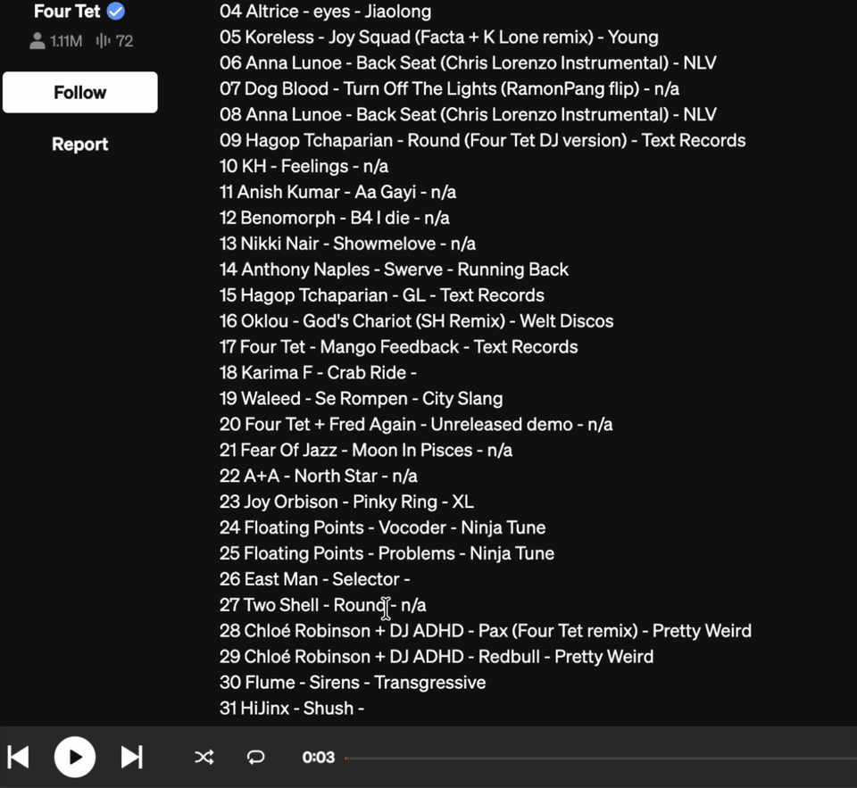

# tIDl

A Chrome extension for identifying tracks from DJ sets. Highlight text on any webpage to instantly search Tidal and manage your music library — add favorites, manage playlists — without leaving the page.

## Demo



## Features

- Highlight any text → floating button appears → click to search Tidal inline
- Right-click selected text → "Search in Tidal" context menu
- Add tracks to favorites or any of your playlists
- See which playlists already contain a track
- OAuth 2.0 login via your Tidal account

## Setup (for contributors)

You need your own Tidal OAuth app credentials to build from source. The published Chrome Web Store extension works out of the box for end users.

1. Register an OAuth app at [developer.tidal.com](https://developer.tidal.com)
   - Set the redirect URI to `https://<your-extension-id>.chromiumapp.org/`
2. Copy `.env.example` to `.env` and fill in your credentials:
   ```
   cp .env.example .env
   ```
3. Install dependencies:
   ```
   npm install
   ```
4. Build the extension:
   ```
   npm run build
   ```
5. Load in Chrome:
   - Go to `chrome://extensions`
   - Enable **Developer mode**
   - Click **Load unpacked** → select the `dist/` directory

After editing source files, run `npm run build` and click the reload button on the extension card. Content script changes also require refreshing the target tab.

## Development

```bash
npm run watch      # rebuild on file changes
npm run typecheck  # type-check only
npm test           # run tests
```

## License

MIT
